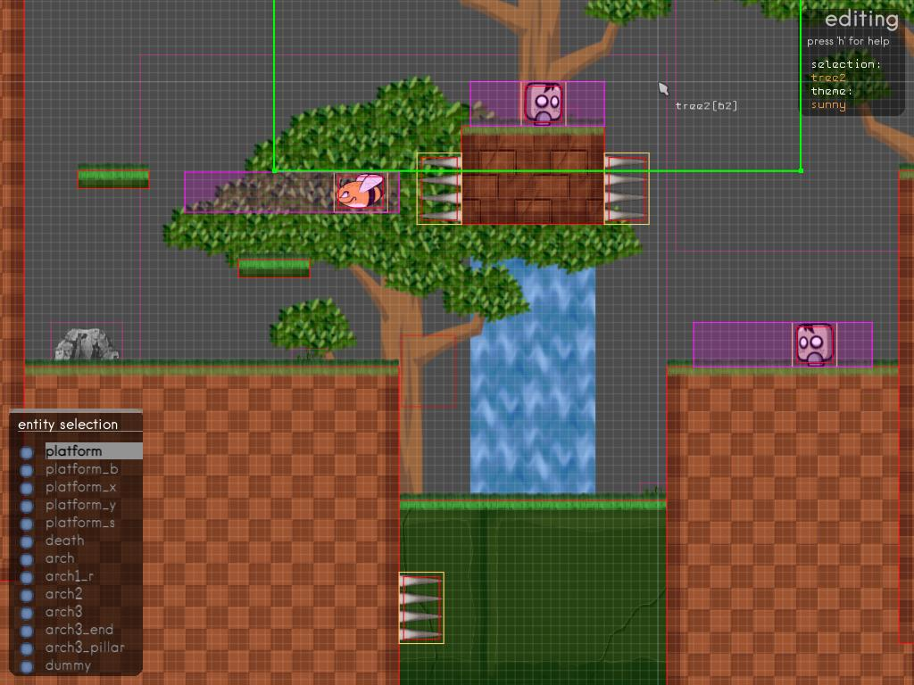
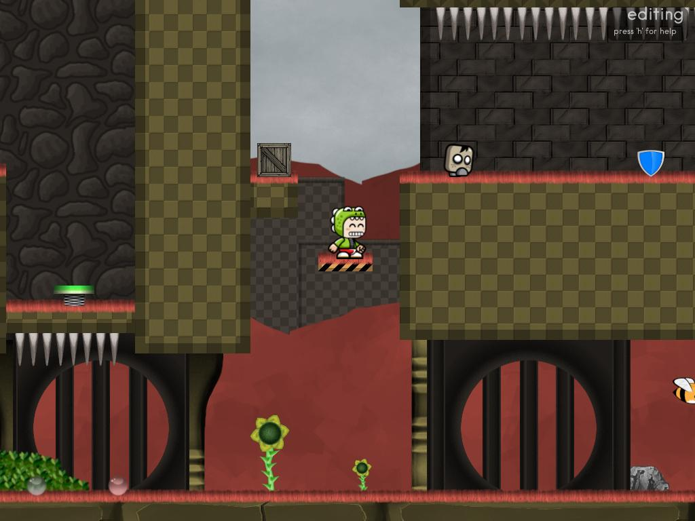
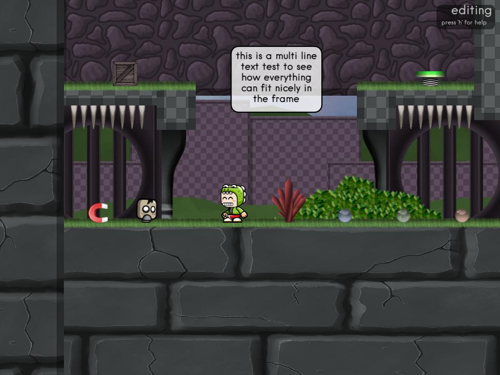

**Boxclip** is a 2D platformer engine, with an emphasis on interactive map editing. Built using the [LÖVE2D](https://love2d.org/) framework.

Maps can be created with the custom built-in map editor. Simply drop and place entities into the world.

[](screenshots/1.jpg)

### Features
* game mode
* editor mode
* fully customizable world
* [STALKER-X](https://github.com/SSYGEN/STALKER-X) (camera module)
* simple AABB collisions
* gravity / velocity
* moving platforms
* player powerups
* destroyable crate pickups
* springs / bumpers
* traps / enemies
* unlimited map size restrictions
* map states

Visit the [Wiki](https://github.com/Jigoku/boxclip/wiki) for help with game controls and editor tips.

### Using the editor
(click the image to play) 
[](https://www.youtube.com/watch?v=WS5fl4KJfOY)

### Get the development branch
```
$ git clone git@github.com:Jigoku/boxclip.git
```

### Run the game/engine
Install [love2d](https://love2d.org/) (at least version 11.1), and simply type
`love .` in the *src/* directory or you can create a love executable which can be ran directly by using the Makefile:

```
$ make && make all
```
Windows archives are not currently available, but you can create them using the above. Find them in `dist/win{32,64}/boxclip-0.2-win{32,64}.zip`

### Note
Please note this is alpha software, there is no stable release yet. Currently the plans are to have a box collision based world with a map editor, and simple path-based enemies. This may change at any time! 

[](screenshots/2.jpg)

[](screenshots/3.jpg)


